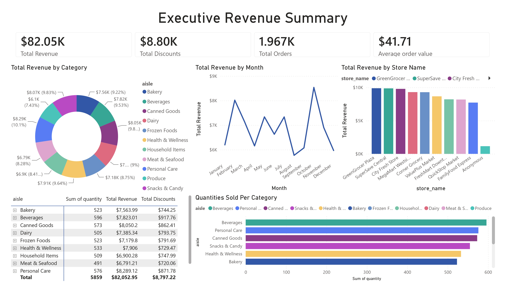

# Retail Sales Performance & Customer Loyalty Optimization Dashboard

An end-to-end data analytics and business intelligence project exploring multi-store retail transactions to optimize store revenue, promotional strategies, and customer loyalty programs.
---

## Executive Summary
This project analyzes **1,967 transactions** across 9 regional storefronts between August 2023 and August 2025. By cleaning promotional data anomalies and auditing transaction schemas, this pipeline establishes key revenue performance indicators ($82.05K total revenue, $41.71 average basket size) and provides actionable insights into customer purchasing behaviors.

---

## Tech Stack
- **Database / SQL:** MySQL (DDL Schema, Staging Views, Aggregations, Window Functions)
- **Data Engineering / ETL:** Python (`pandas`, `sqlalchemy`)
- **Data Visualization & BI:** Power BI Desktop (DAX Measures, Data Modeling, Custom KPI Cards)
- **Exploratory Data Analysis:** Python (`matplotlib`, `seaborn`)

---

## Business Key Performance Indicators (KPIs)

| Metric | Value | Business Relevance |
| :--- | :--- | :--- |
| **Total Net Revenue** | **$82,052.95** | Total positive cash flow across all stores |
| **Total Orders** | **1,967** | Audited transaction count |
| **Average Basket Value** | **$41.71** | Mean spend per purchase transaction |
| **Total Discounts Awarded** | **$8,797.22** | Promotional savings passed to consumers |

---

## Key Insights & Business Findings

1. **Data Quality & Over-Discounting Bug:**
   - Identified 13 transactions (~0.65% of dataset) where `discount_amount` exceeded `total_amount`, generating negative final amounts. These were pruned during ETL to reflect accurate gross and net margin cash flows.
2. **Top Performing Outlets:**
   - **GreenGrocer Plaza** ($9,880.76) and **SuperSave Central** ($9,859.89) lead total revenue generation.
3. **Loyalty Program Inefficiency:**
   - Statistical correlation between customer `loyalty_points` and transaction size is virtually zero ($r \approx 0.0159$). Current loyalty distributions fail to incentivize higher basket sizes, recommending a shift to tiered rewards.

---

